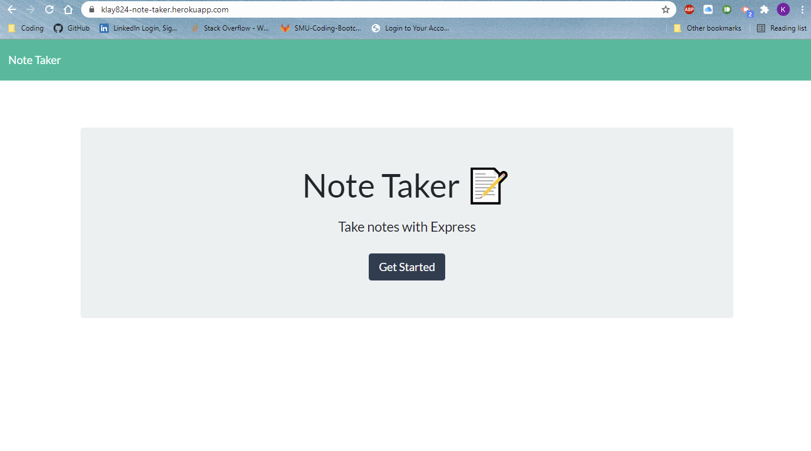
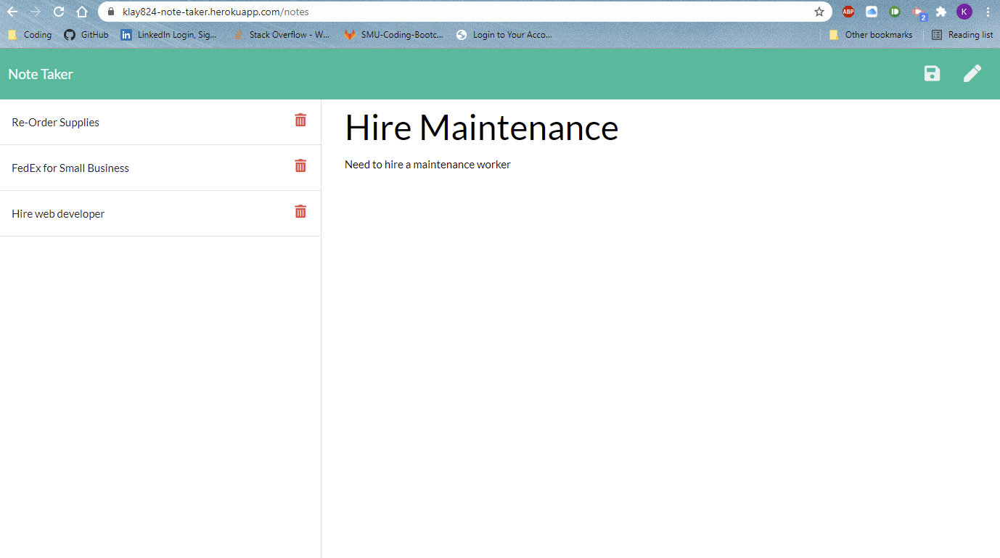
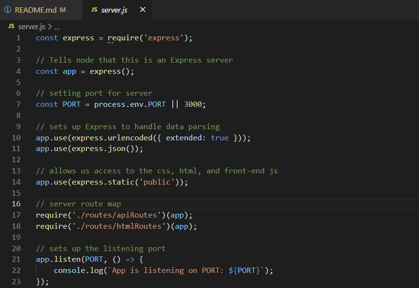
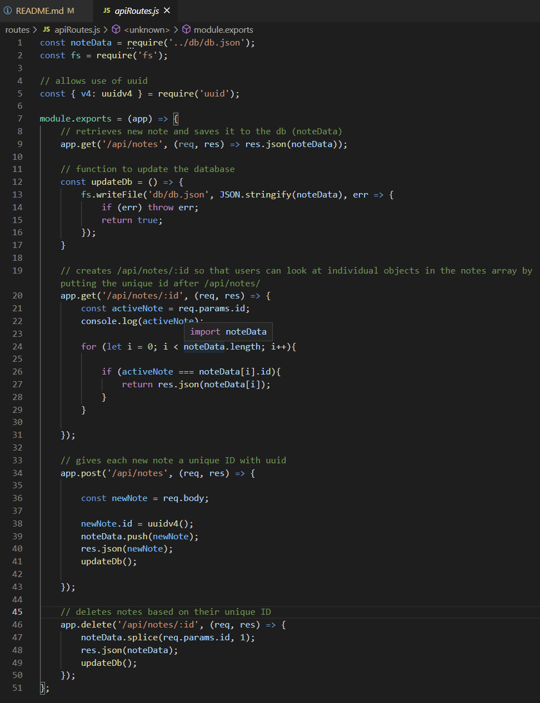
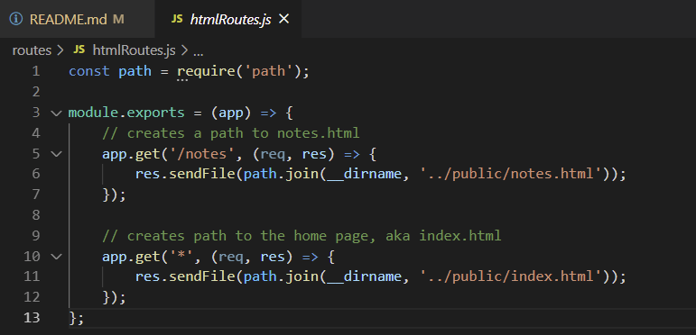

# Note Taker Application 
 

## Table of Contents
* [Description](#description)
* [Technology Used](#technology)
* [Resources](#resources)
* [Licensing Information](#licensing)
* [GIF Demonstration](#GIF)
* [Screenshots](#screenshots)
 

## Description
This is a project using Node.js and Express.js to create a server on which to host the website and a database on the server to save user's stored information. When the user opens Note Taker, they are presented with a landing page with a link to a notes page. When the user clicks on the notes link, the user is presented with existing notes on the left-hand column, plus empty fields to enter a new note title and the note's text in the right-hand column. When a user enters a new note title and the note's text, then a Save icon appears in the navigation at the top of the page. When the user clicks the save icon, then the new note the user has entered is saved and appears in the left-hand column with the other existing notes. When the user clicks on an existing note in the list in the left-hand column, then that note appears in the right-hand column. When the user clicks on the Write icon in the navigation at the top of the page, then the user is presented with empty fields to enter a new note title and note's text in the right-hand column. When the user clicks on the trash icon next to each note, the note is deleted from the page and the database.
 

## Technology Used
* Node.js
* Express.js
* UUID NPM Package
 

## Resources
* [Serving static files in Express](https://expressjs.com/en/starter/static-files.html)
* [Generate a Universally Unique Identifier](https://www.devextent.com/npm-generate-unique-id/)
 

## Licensing Information
This project is covered under the MIT license.
 

## GIF

 

## Screenshots

 

 

 

 
